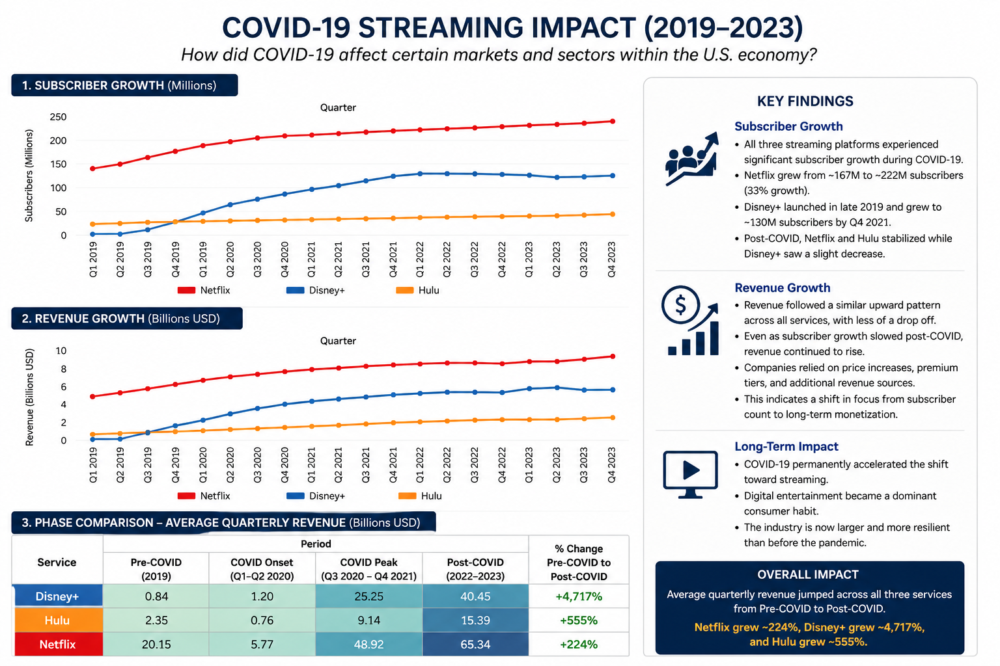

# COVID-19 Impact on U.S. Markets and Industries (2019-2023)

## Project Overview

This project investigates the impact of the COVID-19 pandemic on sectors of the U.S. economy through data visualization and financial analysis.

### Research Question
**How did COVID-19 affect certain markets and sectors within the U.S. economy?**

---

## Case Study: Streaming Services

### Companies Analyzed
- Netflix
- Disney+
- Hulu

### Metrics Examined
- Quarterly Subscriber Growth
- Quarterly Revenue
- Pre-COVID vs COVID vs Post-COVID Performance

---

## Key Findings

- Streaming services experienced significant subscriber growth during COVID-19.
- Revenue continued to increase after subscriber growth began to stabilize.
- Consumer behavior shifted toward long-term digital entertainment.
- COVID-19 accelerated trends that continued beyond the pandemic.

---

## Dashboard

---

## Author

**Iris Park**

University of California, Riverside
