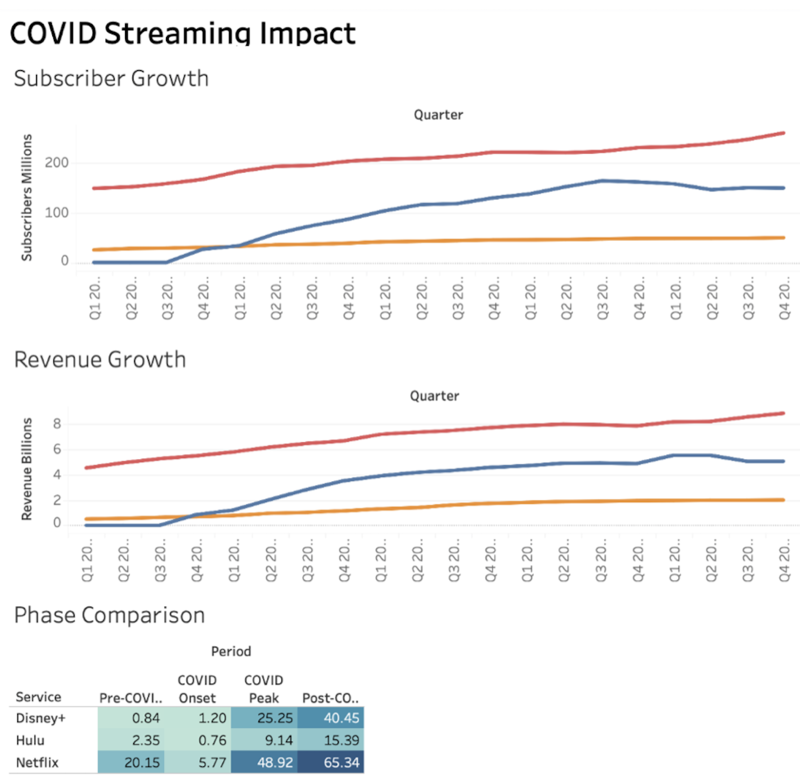

# COVID-19 Impact on U.S. Markets and Industries (2019-2023)

## Project Overview

This project investigates the impact of the COVID-19 pandemic on sectors of the U.S. economy through data visualization and financial analysis.

### Research Question
**How did COVID-19 affect certain markets and sectors within the U.S. economy?**

---

## Case Study: Streaming Services

### Companies Analyzed
- Netflix
- Disney+
- Hulu

### Metrics Examined
- Quarterly Subscriber Growth
- Quarterly Revenue
- Pre-COVID vs COVID vs Post-COVID Performance

---

## Data Source

- Dataset: [`streaming_covid_data.csv`](data/streaming_covid_data.csv)

---

## Dashboard

---

## Key Findings

### Subscriber Growth
- All three streaming platforms experienced significant subscriber growth during COVID-19.
- Netflix increased from approximately 167 million to over 220 million subscribers.
- Disney+ experienced rapid expansion following its late 2019 launch.
- Subscriber growth slowed after pandemic restrictions eased.

### Revenue Growth
- Revenue continued to increase even after subscriber growth stabilized.
- Streaming companies relied on pricing strategies and premium subscription models.
- Revenue trends proved more resilient than subscriber trends.
  
### Long-Term Impact
- COVID-19 permanently accelerated the shift toward digital entertainment.
- Consumer behavior established during the pandemic remained strong after restrictions ended.
- The streaming industry emerged larger and more profitable than before COVID-19.

---

## Conclusion

The COVID-19 pandemic fundamentally changed the streaming industry by accelerating digital adoption and increasing demand for online entertainment. While subscriber growth eventually stabilized, revenue continued to increase, demonstrating that many pandemic-driven consumer habits became permanent.

This analysis suggests that COVID-19 acted as a catalyst for long-term structural changes within the U.S. economy.

--

## Author

**Iris Park**

University of California, Riverside
